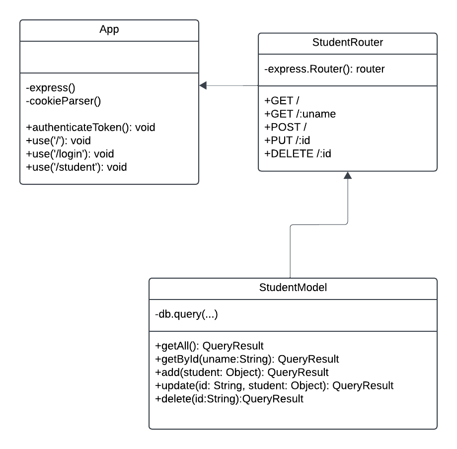

# Peppi esimerkki

Teen esimerkkinä sovelluksen, jonka toiminta on  seuraava 

Aluksi hahmottelin ER-kaaviota seuraavasti:

Ja lopullinen ER-kaavio on seuraava:

## Luokkakaavio

Backendin osalta luokkakaavio olisi allaoleva. Laitoin kuitenkin siihen vain Student-taulun osuuden ja App.js:n.

## Backend

Jotta sovellus toimii on kloonauksen jälkeen tehtävä seuraavat toimenpiteet:

<ol>
<li>Luodaan tietokanta suorittamalla db_dump.sql tiedosto MySQL:ssä</li>
<li>Luodaan MySQL-käyttäjä ja annetaan oikeudet suorittamalla komennot
<pre>
CREATE USER peppiuser@'localhost' IDENTIFIED BY 'peppipass';
GRANT ALL ON peppi.* TO peppiuser@'localhost';
</pre>
</li>
<li>Luodaan tiedosto nimeltään <b>.env</b> backend-kansion juureen ja kopioidaan sinne tiedoston backend/example_env sisältö </li>
<li>Ajetaan backend-kansiossa komento <b>npm install</b></li>
</ol>